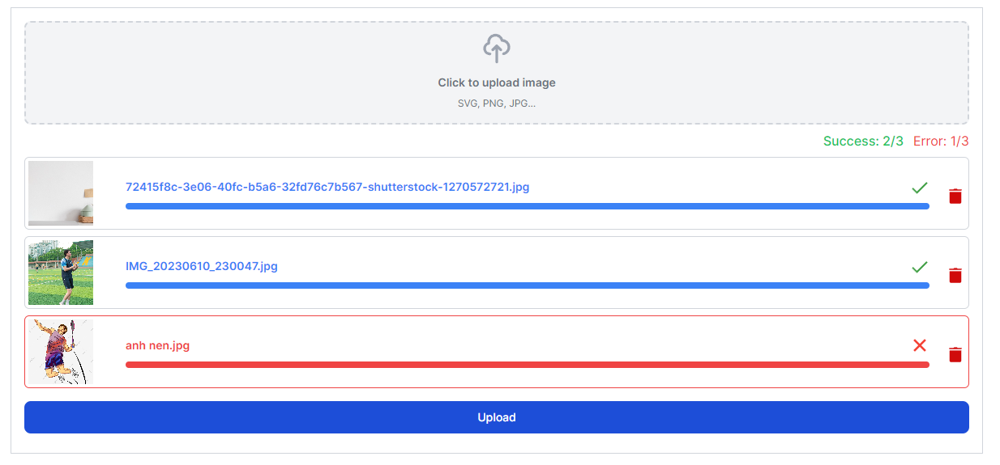

# Upload Multiple Image

## Introduction - Simple Web Application for Uploading Multiple Images
This is a simple web application that allows you to upload multiple images to a server at once, with a progress bar displaying the number of images uploaded successfully and the number of images that failed to upload.

Note: photos are uploaded one by one.
## Installation

To install the dependencies for this project using `pnpm`, run the following command:
```bash
pnpm install
```
This will install all of the dependencies listed in the package.json file.

## Development
To start the development server, run the following command:

```bash
pnpm dev
```
This will start the development server and allow you to view the project in your web browser.

Note: Before running these commands, make sure that you have pnpm installed on your system. If you don't have it installed, you can follow the instructions on the pnpm website to install it.

## Preview

Click on the image or URL: https://upload-multiple-image.vercel.app/

[](https://upload-multiple-image.vercel.app/)
